# Starting BORIS

Once BORIS App is installed, it can be launched by taping on its icon.

The BORIS main window will appear. At this stage, all toolbar commands are disabled except the Preferences button.

<figure markdown>
  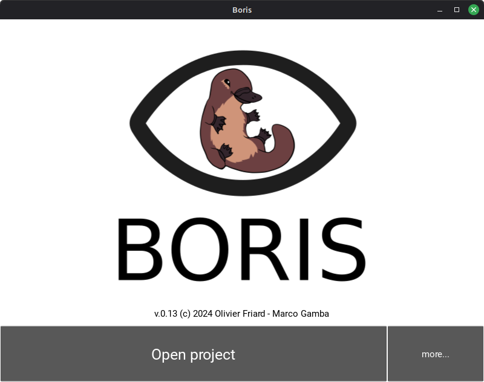
  <figcaption>The BORIS App main screen</figcaption>
</figure>

# Open a project

* Press the **Open project** button

A list of available BORIS project files will open

<figure markdown>
  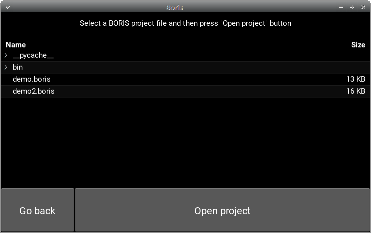
  <figcaption>The list of BORIS projects</figcaption>
</figure>

* Select a file and press the **Open project** button

BORIS App will show a summary of the selected project:

<figure markdown>
  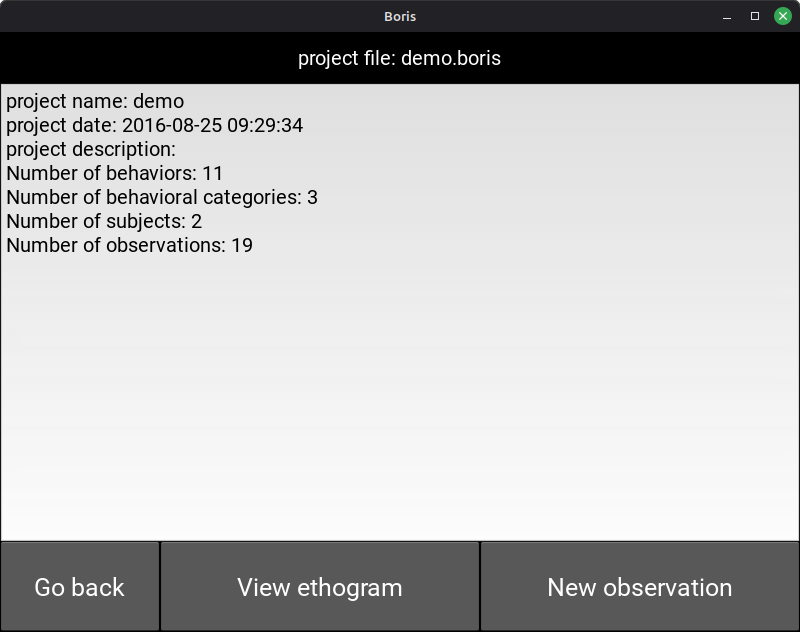
  <figcaption>Details of the project</figcaption>
</figure>

You can visualize the ethogram by pressing the **View ethogram** button

<figure markdown>
  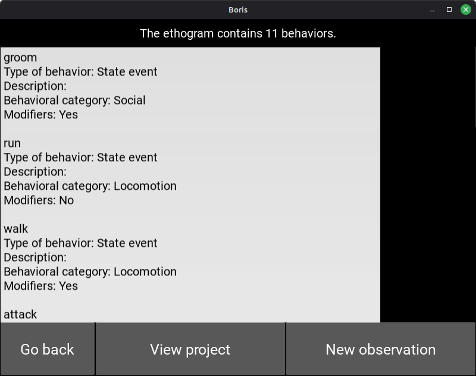
  <figcaption>Ethogram of the open project</figcaption>
</figure>

# Start a new observation

* Press the **New observation** button

<figure markdown>
  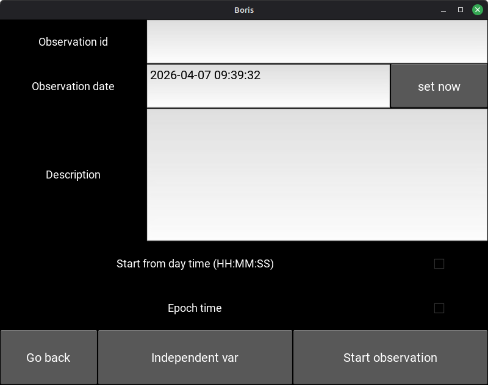
  <figcaption>New observation</figcaption>
</figure>

* Input an **Observation id** (mandatory, this id must be unique in your project)

* Change the date (optional, default: current date time)

* Input a description for your observation (optional)

* If independent variables are defined, click on the **Independent var** button and fill the value for each variable.

<figure markdown>
  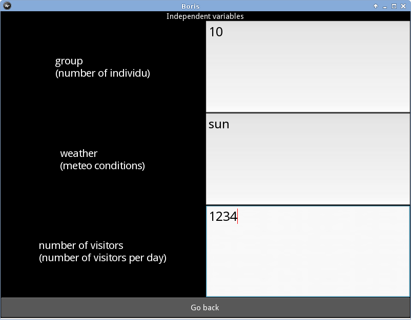
  <figcaption>The independent variables defined in the project</figcaption>
</figure>

* Press the **Start observation** button

You will obtain a screen with buttons corresponding to behaviors defined in your project.
You can press it to code behaviors. The event time will be recorded in your observation.

<figure markdown>
  
  <figcaption>The running observation</figcaption>
</figure>

If behavioral categories are defined in your project, the behaviors will be grouped by category and
buttons will be colored.

## Select the focal subject

* Press the **Select focal subject** button

* Select the focal subject. If the focal subject is already selected, the subject will be deselected.

<figure markdown>
  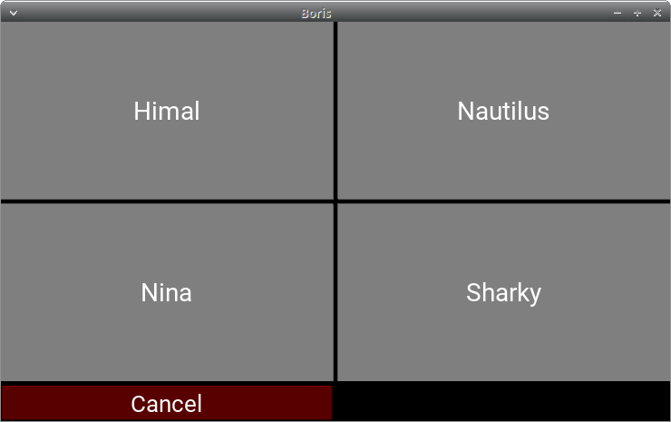
  <figcaption>Select the focal subject</figcaption>
</figure>

The focal subject will be show in the green button (at left bottom).

<figure markdown>
  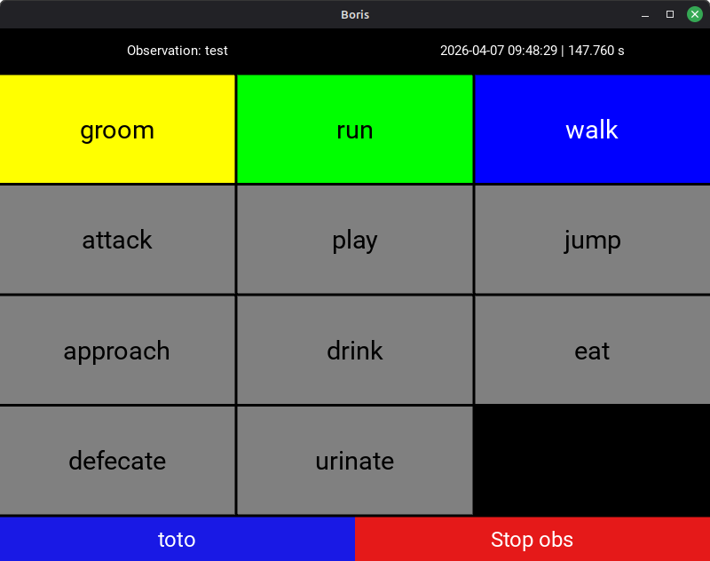
  <figcaption>The running observation with a subject selected</figcaption>
</figure>

## State events

If you press on a state event, the corresponding behavior button will be highlighted in red until you press it again
to stop the state event.

<figure markdown>
  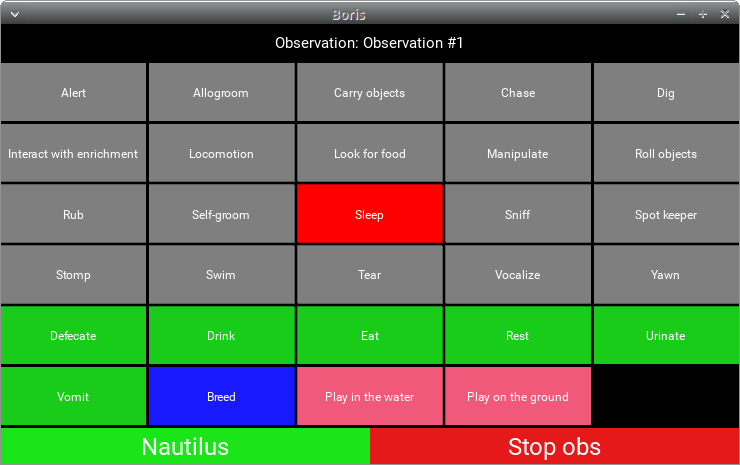
  <figcaption>A state event</figcaption>
</figure>

## Modifiers selection

If modifiers are defined for the triggered behavior, BORIS App will show the modifiers page.

They are 3 types of modifiers:

* Single item selection from a list

* Multiple items selection from a list

* Numerical

Various sets of modifiers can be defined for a behavior.

BORIS App will show a page with all sets of modifiers defined for the current behavior.

### Example for one set of modifiers (single item).

<figure markdown>
  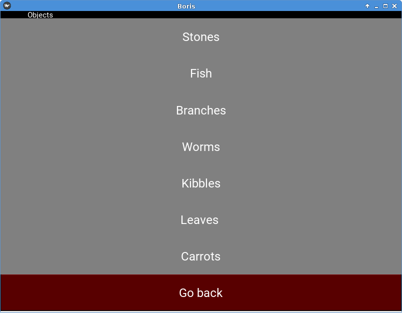
  <figcaption>One set of single modifier</figcaption>
</figure>

### Example for one set of modifiers (multiple items). 2 modifiers are selected.

<figure markdown>
  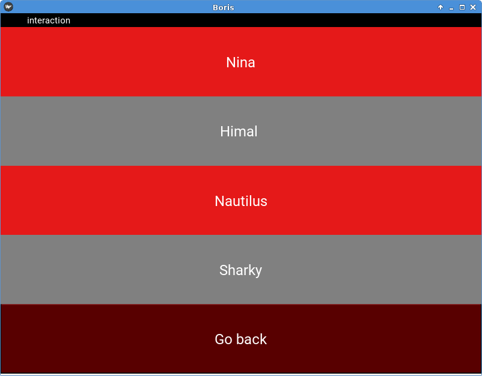
  <figcaption>One set of multiple modifiers</figcaption>
</figure>

### Example for 2 sets of modifiers (single item)

<figure markdown>
  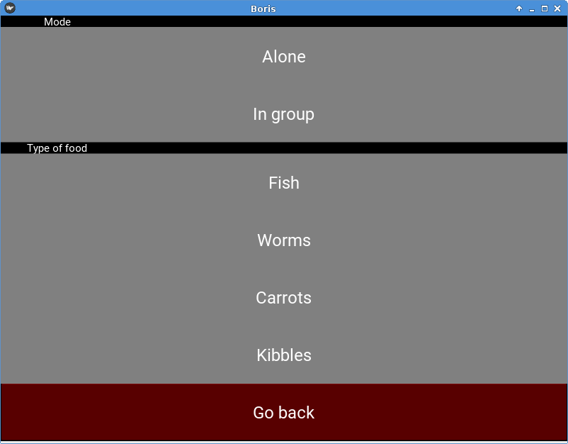
  <figcaption>2 sets of modifiers</figcaption>
</figure>

# Stop the observation

* Press the **Stop observation** red button. Confirm that you want to stop the observation.

The observation will be saved in the current project.

# Limitations

These limitations should be fixed in next releases.

* BORIS App can not handle independent variables defined as **set of values**
